# CSS3动画系列
css3动画适合于实现一些简单的，基础动画，如果要实现一些特别复杂的动画效果比如按照自定义的不规则曲线进行运动，或者涉及到多个关键帧并且每个关键帧有不同的运动状态的话，在当前用css3就不太适合了。还是要配合svg、flash、js等其他技术来实现。

## transition相关
transition从效果上看它更像是一个过渡动画，当一个状态A转变到另一个状态B的过程，如果没有设置效果的话它会直接转变过去，如果我们在这个过程当中添加一个transition的效果的话，那么从A状态到B状态就会有动画形式的效果展现这个变化的过程。

### transition属性介绍
transition是一个复合属性，一共可拆分出四个具体的属性  
* transition-property：设置对象中参与过渡的属性, 默认值为all  
* transition-duration：设置对象过渡的持续时间, 默认值为0  
* transition-timing-function：指定对象中过渡的动画类型, 默认值为ease  
* transition-delay：设置对象延迟过渡的时间，也就是设置过渡动画开始前的等待时间,默认值为0  

### 注意要点
 * 在transition中，必定要有个初始值和结束值,过渡动画才生效。

 * transition是设在我们想要设置过渡的那个元素上，然后transition会对我们设置的transition-property值的状态进行监听，如果状态有改变且发生状态变化的这个属性是支持动画过渡的话，那么transition就会以动画过渡的方式改变元素的状态。

 * 这4个属性中transition-property和transition-duration是必填的

 * transition-timing-function中的大部分动画类型都是对应于贝塞尔曲线（cubic-bezier）中特定值（坐标）的曲线,比如linear：线性过渡。等同于贝塞尔曲线(0.0, 0.0, 1.0, 1.0),当然也可以直接用贝塞尔曲线函数自定义一个动画类型

 * transition-timiong-function每一个值都表示一种特定的运动状态 
 
## API

| Option | Description | Type |  
|--------| ----------- | ---- | 
| linear | 线性过渡 | 等同于贝塞尔曲线(0.0, 0.0, 1.0, 1.0) |  
| ease   | 平滑过渡 | 等同于贝塞尔曲线(0.25, 0.1, 0.25, 1.0) |  
| ease-in |由慢到快 | 等同于贝塞尔曲线(0.42, 0, 1.0, 1.0) |  
| ease-out | 由快到慢 | 等同于贝塞尔曲线(0, 0, 0.58, 1.0) |  
| ease-in-out | 由慢到快再到慢 | 等同于贝塞尔曲线(0.42, 0, 0.58, 1.0) |  

 * css中有些属性是不支持过渡动画的，比如display。如果不明白某一个属性是否支持动画效果，可以到[css参考手册][1]查找对应的属性，每个属性都有一个语法，其中的动画性会有具体描述是否有动画效果

transition支持为同一个元素定义多个过渡的属性, 属性之间用逗号隔开
比如
```
div{
    height: 100px;
    width: 100px;
    background: red;
    transition:
        backgroundColor 2s linear,
        height 2s ease-in,
        width 2s ease-out;
}
```

### transition的用法

有如下一个div
```
div{
    height: 100px;
    width: 100px;
    background: red
}

div:hover{
    height: 200px;
    width: 300px;
    background: yellow
}
```
当鼠标停留在该div上时，这个div会立即由红色的100*100正方形变成黄色的300 * 200的长方形，这是我们未加过渡的效果
当我们加上过渡的时候, 可以发现就有一个过渡的效果。
```
div{
    height: 100px;
    width: 100px;
    background: red;
    transition: all 1s;
}
```
[transition的demo][2]  
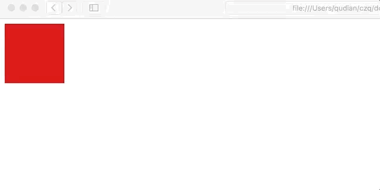
### transition的兼容性
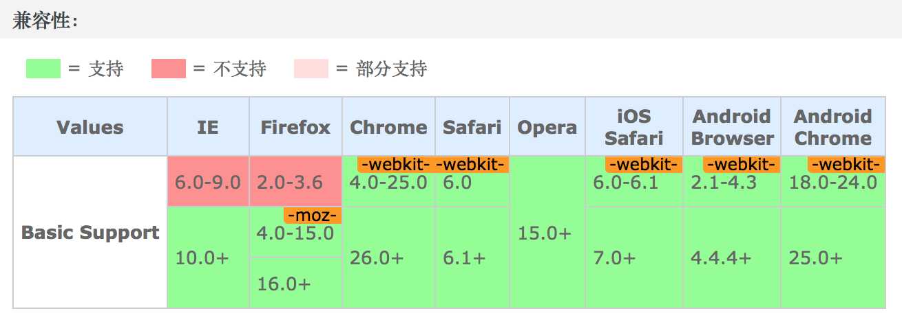


## animation相关
与transition相比，animation除了从状态A变为状态B之外，还支持从状态B变到状态C。再变到D状态，...，一直变化下去
也就是说animation可以实现一个多状态改变的连续动画，transition则只能实现一个状态改变的动画。相比之下，animation则更为强大和完整，css3的动画主要也是围绕animation展开的。

### animation属性介绍  

animation-name: 检索或设置对象所应用的动画名称(自定义)
animation-duration: 设置动画的持续时间
animation-timing-function: 设置动画的过渡类型
animation-delay: 设置动画延迟的时间
animation-iteration-count: 设置动画的循环次数
animation-direction: 设置动画在循环中是否反向运动
animation-fill-mode: 设置动画时间之外的状态
animation-play-state: 设置对象动画的状态（w3c考虑移除该状态）

### 注意要点:
* animation是一个复合属性。检索或设置对象所应用的动画特效，是以上8种属性的复合。 animation至少必须填写俩个值animation-name和animation-duration
* 如果提供多组属性值，以逗号进行分隔。
* 如果只提供一个<time>参数，则为 <' animation-duration '> 的值定义；如果提供二个<time>参数，则第一个为 <' animation-duration '> 的值定义，第二个为 <' animation-delay '> 的值定义
* 在使用animation时必须要用到一个关键帧容器@keyframes用来存放每一个状态，比如
@keyframe run{
    这里记录动画的运动状态，有几个状态就记录几个关键帧
}
* ，关键帧的写法可以是百分数的形式或者from...to...的形式，关键帧之间不需要用逗号隔开，也可以百分数和from...to...组合的形式书写，但是要注意from，to只能代替0%和100%而不可以是其他。

* animation支持多种动画作用于同一个元素，只要在animation属性用逗号间隔开即可并行的加载俩种不同的动画

* animation-timing-function设置的是每一个关键帧的运动状态，而不是设置到整个动画的运动状态，从这个特性可以看出animation可以做到每个关键帧都一样的运动状态，如果有需求是每个关键帧的运动状态都不一样的话，那么css3就无法实现，这也是css3的animation动画的局限之处，要实现这样子的需求可以通过配合js来实现,或者通过transition来实现，但实现方式就比较复杂，有点得不偿失了。

* animation-iteration-count的取值：number | infinite，默认为1

* animation-direction取值：  
normal： 正常方向  
reverse： 反方向运行  
alternate： 动画先正常运行再反方向运行，并持续交替运行  
alternate-reverse： 动画先反运行再正方向运行，并持续交替运行

* animation-play-state:适用于所有的元素,包含伪元素::before和::after, 取值包括running(运动)（默认）， paused(暂停)
这个属性在不同浏览器实现的效果是不一样的，由暂停状态切回运动状态时有的浏览器会从暂停的位置开始运动，有的浏览器会从最初的位置重新开始运动（w3c正考虑移除该属性，因为在一些场景中会有错误行为而且部分浏览器不支持伪元素动画，或者支持得不够好，尽可能不要利用伪元素来做动画），最好通过其他方式控制运动状态
* animation-fill-mode: 
### animation的用法
 [animation 的demo][3]


### animation的兼容性
 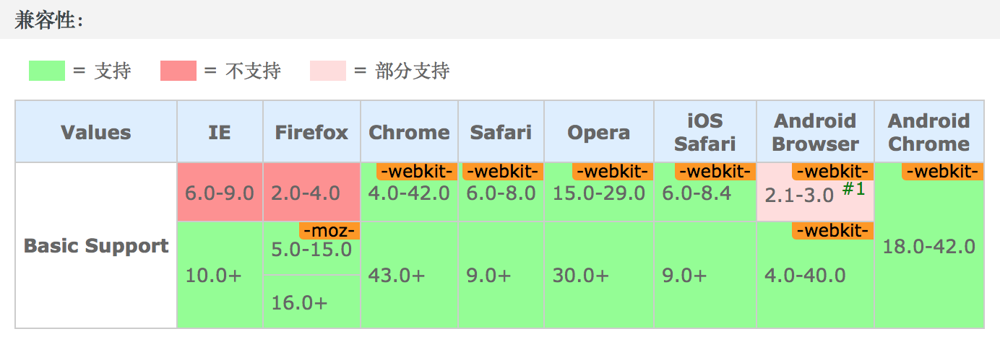

## transform相关
### transform（变换）属性介绍

transform: 检索或设置对象的变换 默认值： none  
transform-origin： 检索或设置对象中变换所参照的原点 默认值： 50% 50%  
transform-style： 指定某元素是位于三维空间内，还是在该元素所在平面内 默认值： flat  
perspective: 指定观察者与「Z=0」平面的距离 默认值： none  
perspective-origin: 指定透视点的位置 默认值： 50% 50%  
backface-visibility： 指定元素背面面向用户时是否可见 默认值： visible

### transform的取值
默认值： none  
    none：
    无转换  
### tranform注意要点：
* transform有多种类型，常用的包括平移（translate），旋转(rotate)，缩放(scale), skew(拉伸)等, 它的实现原理是通过矩阵的变换得到的， css3也提供了这样的一个方法，用来自定义变换的内容，matrix。
* 从变换类型来看包括2D变换和3D变换，书写为matrix()和matrix3d(),前者是元素2D平面的移动变换，后者则是3D变换， 2D变换矩阵为3 * 3， 3D变换矩阵则是 4 * 4。有点迷糊？下面就具体的介绍一下这个transform。
#### 2D Transform Functions：  
    matrix()：
    以一个3 * 3矩阵形式指定一个2D变换，相当于直接应用一个[a,b,c,d,e,f]变换矩阵  
    translate()：
    指定对象的2D translation（2D平移）。第一个参数对应X轴，第二个参数对应Y轴。如果第二个参数未提供，则默认值为0  
    translatex()：
    指定对象X轴（水平方向）的平移  
    translatey()：
    指定对象Y轴（垂直方向）的平移  
    rotate()：
    指定对象的2D rotation（2D旋转），需先有 <' transform-origin '> 属性的定义  
    scale()：
    指定对象的2D scale（2D缩放）。第一个参数对应X轴，第二个参数对应Y轴。如果第二个参数未提供，则默认取第一个参数的值  
    scalex()：
    指定对象X轴的（水平方向）缩放  
    scaley()：
    指定对象Y轴的（垂直方向）缩放  
    skew()：
    指定对象skew transformation（斜切扭曲）。第一个参数对应X轴，第二个参数对应Y轴。如果第二个参数未提供，则默认值为0  
    skewx()：
    指定对象X轴的（水平方向）扭曲  
    skewy()：
    指定对象Y轴的（垂直方向）扭曲  
### 3D Transform Functions：
    matrix3d()：
    以一个4x4矩阵的形式指定一个3D变换  
    translate3d()：
    指定对象的3D位移。第1个参数对应X轴，第2个参数对应Y轴，第3个参数对应Z轴，参数不允许省略  
    translatez()：
    指定对象Z轴的平移  
    rotate3d()：
    指定对象的3D旋转角度，其中前3个参数分别表示旋转的方向x,y,z，第4个参数表示旋转的角度，参数不允许省略  
    rotatex()：
    指定对象在x轴上的旋转角度  
    rotatey()：
    指定对象在y轴上的旋转角度  
    rotatez()：
    指定对象在z轴上的旋转角度  
    scale3d()：
    指定对象的3D缩放。第1个参数对应X轴，第2个参数对应Y轴，第3个参数对应Z轴，参数不允许省略  
    scalez()：
    指定对象的z轴缩放  
    perspective()：
    指定透视距离   

### matrix、matrix3d属性的介绍以及使用方法
#### MATRIX应用场景
MATRIX(包括matrix和matrix3d，下文以这种形式指代它们的集合)涉猎面蛮广的，在CSS3以及HTML5的世界里面都有它的身影，比如canvas和svg。（这里我们暂只介绍它在CSS3中的应用）  
在CSS3中，无论平移、旋转、拉伸什么的，本质上都是应用matrix(修改matrix()固定的几个值)实现的。也就是说他们背后的运作机理都是matrix。一图胜千言，如下图即可解释matrix的作用。  
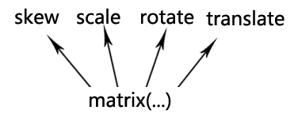  
换句话说，理解CSS3中的matrix矩阵方法有利于透彻理解CSS3中的transform属性。
#### matrix的探索和使用
在[css参考手册]中它是这么定义的： 以一个含六值的(a,b,c,d,e,f)变换矩阵的形式指定一个2D变换，相当于直接应用一个[a,b,c,d,e,f]变换矩阵。

在线性代数中有讲到矩阵的变换形式与其应用，而我们css3中定义的MATRIX方法，就是通过矩阵来表示二维和三维的图形变换。
其中matrix(a, b, c, d, e, f)有六个参数，分别对应于矩阵中的  
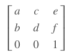  
这个变换矩阵在图形学上又叫做齐次坐标矩阵， 用齐次坐标矩阵和图形的顶点相乘，就能得到变换后的新顶点的位置。
举个栗子：  
 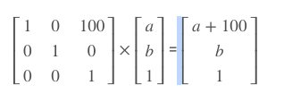   
平面上面有一个点（a, b)经过该变换矩阵后，相当于将该顶点沿x轴平移了100px,平移后该点的位置是（a + 100, b）,也就是相当于transform: translatex(100px)
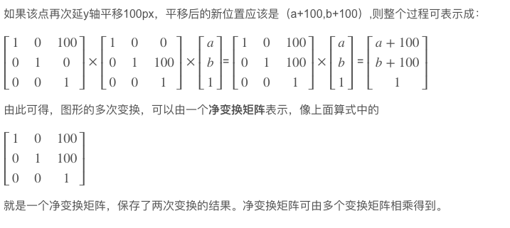
#### 2D变换的相关变换矩阵
我们知道matrix(a, b, c, d, e, f)有六个参数，分别对应于  
  
对于常用的2D变换，以下是其变换矩阵，我们直接使用就好了：
* 平移  
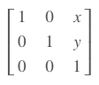  
因此，translate(x, y)也可以写成matrix(1, 0, 0, 1, x, y)，x你只要关注后面x（水平偏移距离了）, y（垂直偏移距离）俩个参数就可以了，。
* 缩放  
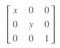  
对应的scale(x, y)也可以写成matrix(x, 0, 0, y, 0, 0)
x: 缩放x轴
y: 缩放y轴
* 拉伸  
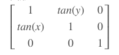  
因此，skew(x, y)也可以写成matrix(1, tan(x), tan(y), 1, 0, 0);
点击这里：[matrix矩阵与l拉伸demo][5]
* 旋转
使用参数: matrix(cosΘ, sinΘ, -sinΘ, cosΘ, 0, 0),就旋转而言，rotate(Θdeg)这种书写形式要比matrix简单多了，首先记忆简单，其次无需记住这么多的三角函数。

#### 3D变换
matrix3d(0,1,2,3,4,5,6,7,8,9,10,11,12,13,14,15)有16个参数，这16个参数对应到矩阵如下：  
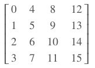  
可以看到，这16个参数是按列排列出矩阵的。3维变换矩阵相比2维变换矩阵增加了一个维度，但是原理是相似的，也是使用齐次坐标矩阵表示变换矩阵。
对于常见的3D变换，以下是其变换矩阵，可以直接拿过来使用
* 平移  
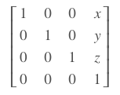  
其中x, y是平移相关的数据所以translate(x, y, z)也可以写成matrix(1, 0, 0, 0, 0, 1, 0, 0, 0, 0, 1, 0, x, y, z, 1)
* 缩放  
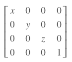  
所以scale(x, y, z)也可以写成matrix(x,0,0,0,0,y,0,0,0,0,z,0,0,0,0,1)  
* 旋转
3维旋转稍微复杂，因为旋转的轴有可能不是标准的x,y,z轴了，而可能是任何一个向量。一般可用欧拉角和四元数表示旋转，而欧拉旋转由于存在“万向节死锁”问题，所以最好还是用四元数来表示， 因为3D旋转比较复杂，在一般场景下使用时，建议直接使用rotate3d。  
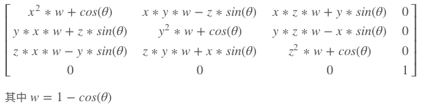  


#### 既然css3给我们封装了好了rotate、translate、skew等方便的接口，那matrix有何用？
确实，对于一般的交互应用，利用transform属性提供的方法是足够的，但是一些其他的效果，如果transform属性没有提供接口方法，那你又该怎么办呢？比如,镜像对称的效果。
点击这里：[matrix与镜像对称的demo][6]
### transform-origin取值： 
percentage： 用百分比指定坐标值。可以为负值。  
length：用长度值指定坐标值。可以为负值。
left： 指定原点的横坐标为left  
center①：指定原点的横坐标为center  
right：指定原点的横坐标为right  
top：指定原点的纵坐标为top  
center②：指定原点的纵坐标为center  
bottom：指定原点的纵坐标为bottom  
### transform-origin注意要点：
transform-origin：检索或设置对象以某个原点进行转换
* 该属性提供俩个参数值
* 如果设置俩个参数，第一个用于横坐标，第二个用于纵坐标。
* 如果只提供一个，该值将用于横坐标，纵坐标将默认为50%
* 对应的脚本特性为transformOrigin


### transform-style: 取值  
默认值： flat  
flat: 指定子元素位于此元素所在的平面内
preserve-3d: 指定子元素定位在三维空间内
### transform-style注意事项
* 决定一个变换的元素看起来是处在三维空间还是平面内，需要该元素的父元素上定义<'transform-style'>属性。

### perspective 取值
默认值: none
none： 不指定透视
length: 指定观察者距离「Z=0平面的距离」，为元素及其内容应用透视变换，不允许负值

### perspective注意要点  
* 当该属性值为「非none」时，元素将会创建局部堆叠上下文。

### perspective-origin 取值
与transform-origin类似
percentage：用百分比指定透视点坐标值，相对于元素宽度。可以为负值。  
length：用长度值指定透视点坐标值。可以为负值。  
left：指定透视点的横坐标为left  
center①：指定透视点的横坐标为center  
right：指定透视点的横坐标为right  
top：指定透视点的纵坐标为top  
center②：指定透视点的纵坐标为center  
bottom：指定透视点的纵坐标为bottom  

### perspective-origin注意要点
* 该属性提供2个参数
* 如果设置2个，第一个用于横坐标，第二个用于纵坐标
* 如果只提供一个，该值将用于横坐标；纵坐标将默认为center
* 对应的脚本特性为perspectiveOrigin

### perspective用法
[一个结合perspective, transform相关属性的demo][4] 
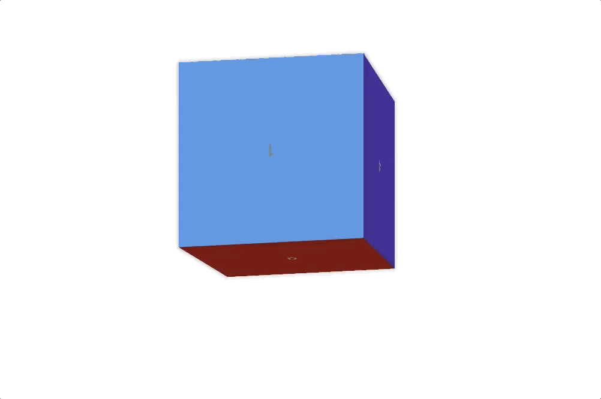
### backface-visibility取值
默认值： visible
visible: 指定元素背面可见，允许显示正面的镜像
hidden： 指定元素背面不可见
### backface-visibility注意要点  
* 决定一个元素背面是否可见，需要直接在该元素上定义<'backface-visibility'>属性，而不能在其父元素上，因为该属性默认为不可继承。


[1]: http://css.doyoe.com "css参考手册"
[2]: ./transition.html "transition用法"
[3]: ./animation.html "animation的demo"
[4]: ./perspective.html "perspective的demo"
[5]: https://www.zhangxinxu.com/study/201206/css3-transform-matrix-skew.html "matrix和skew的demo"
[6]: https://www.zhangxinxu.com/study/201206/css3-transform-matrix-mirror.html "matrix与镜像对称的demo"


